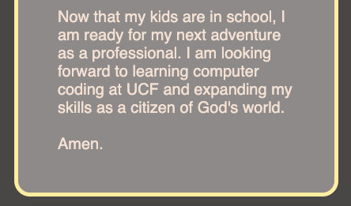

# I.E. Albistu Portfolio

## Application Description
The purpose of this website is to broadcast my skills as Full-Stack Developer.

The navigation on this application works with a bar scroll.

I then begin the site with a picture of myself, 

and some one-word details about myself. I then continue with a small summary about myself.

After that, the application will showcase my websites (currently only using placeholders) to broadcast my skills as a web developer.

At the end of the application there is an "Email" button that will allow any user to email me 

directly by opening their default maill app. The application concludes with my logo.

 
 
 
 

## Link to my Portfolio website

https://atlas-ware.github.io/Challenge02MyPortfolio/

## Website Visual Concept

